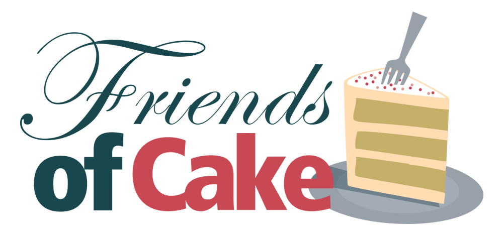
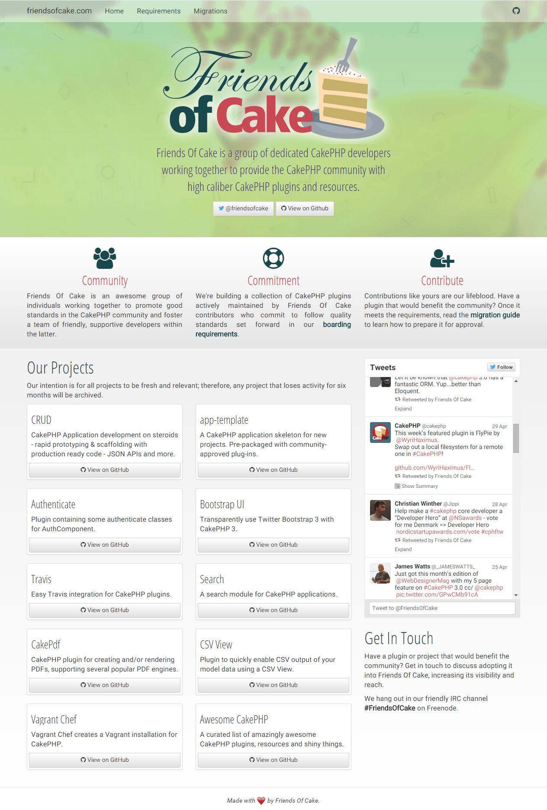

#friendsofcake.com

This repository holds the source code to the [friendsofcake.com](http://friendsofcake.com) website, a [Jekyll](http://jekyllrb.com/)-powered site hosted for free on [GitHub Pages](https://pages.github.com/).

### Development Notes

#### Sitting up a local instance

This project is setup to use [Bundler](http://bundler.io/), [Jekyll](http://jekyllrb.com/), and [Bower](http://bower.io/).

After cloning this repository, run:

1. `bundle install` to download dependencies required to build.
2. `bower install` to download front-end packages into the `./components` directory. (This is not necessary for the `master` branch.)
3. `jekyll serve` to run locally or `jekyll build` to generate into `./site` directory.

### Screenshot

 
